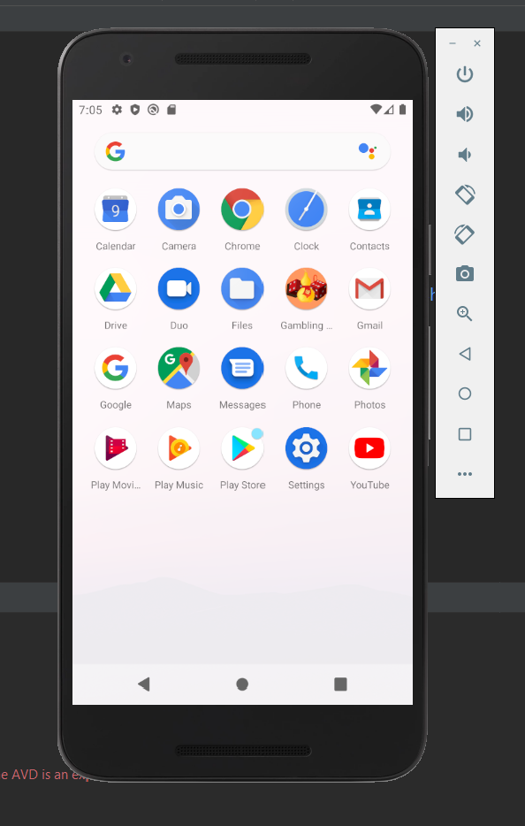
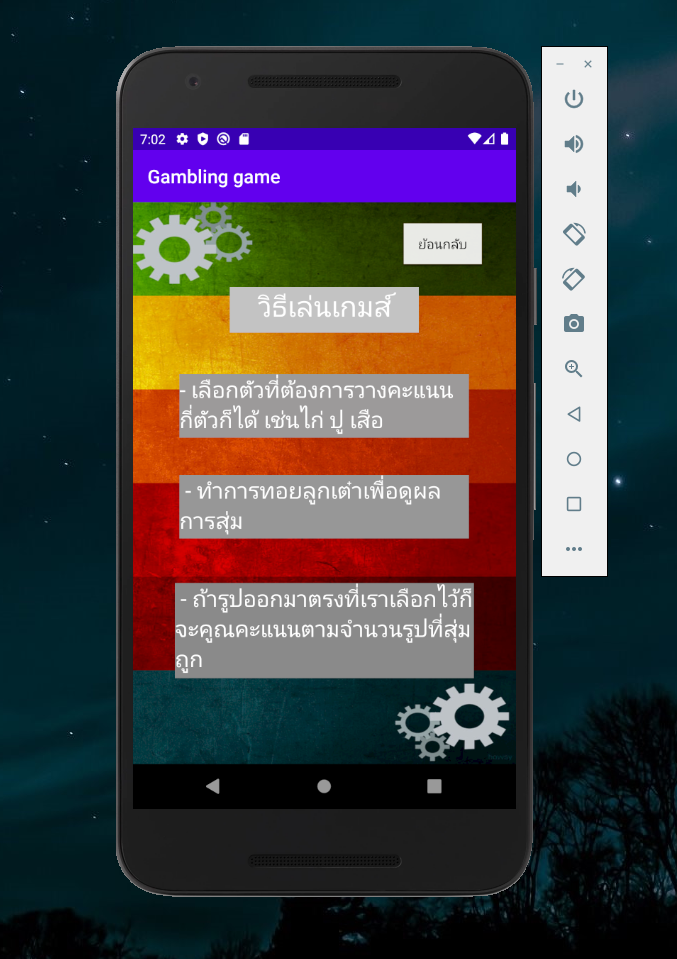

# Object-Oriented-Project
Nam tao pu pla android application using Android Studio

<h5>1. Page ICON</h5>

</img>
<h5>2. Page 1</h5>

</img>
<h5>1. Page ICON</h5>

</img>
<h5>2. Page 1</h5>

</img>
