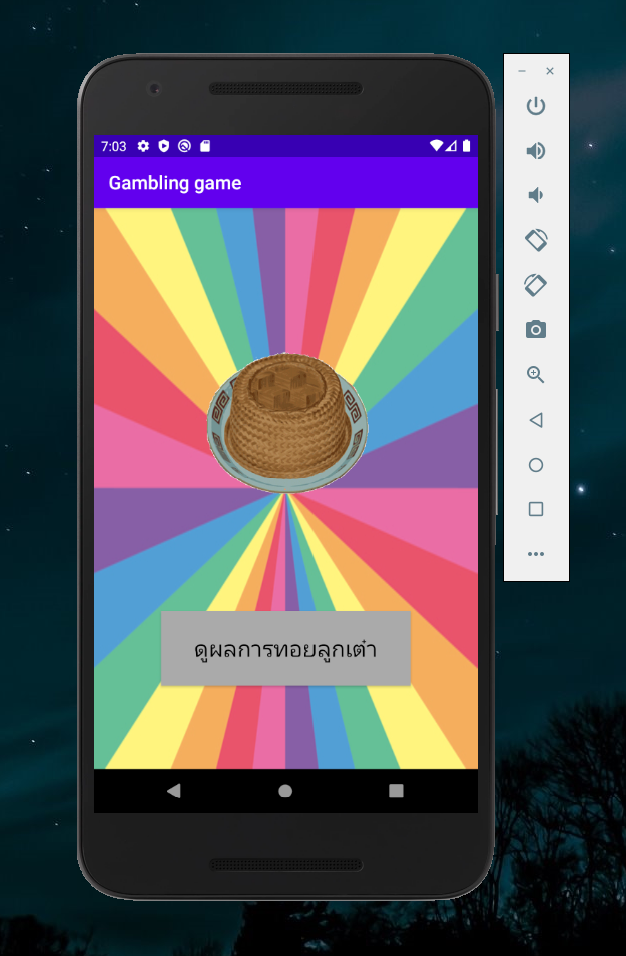

# Object-Oriented-Project
Nam tao pu pla android application using Android Studio

<h5>1. Page ICON<h5> 

</img>
<h5>2. Page 1<h5>   

</img>
<h5>3. Page 2<h5>   

<h5>4. Page 3<h5>   

<h5>5. Page Random<h5>   

<h5>6. Page1Exit<h5>   

